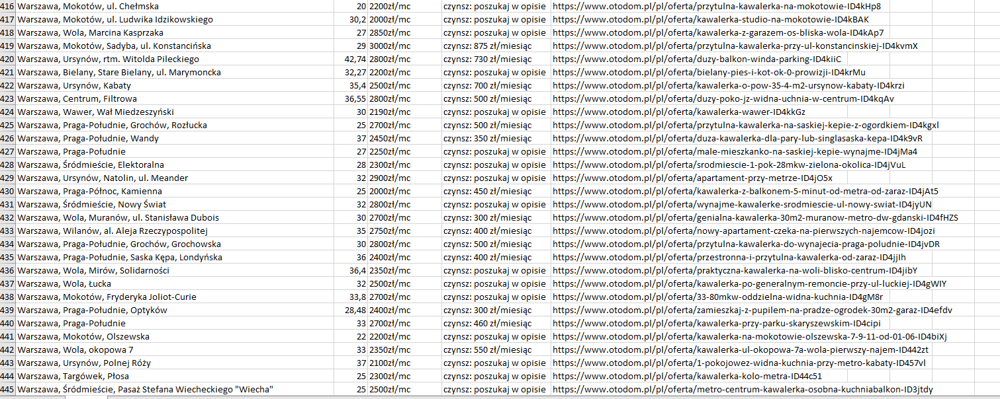

# Otodom scraper
> Scrapes all offers adressess, square footages, prices, links and export it to excel file with timestamp
## Table of Contents
* [General Info](#general-information)
* [Technologies Used](#technologies-used)
* [Setup](#setup)
* [Usage](#usage)
* [Room for Improvement](#room-for-improvement)
* [Contact](#contact)

## General Information
This is my small project to make my life easier, saves my time searching for good deals and helps keep track of current market prices.

## Technologies Used
- Python
- Selenium and Beautifulsoup

## Setup
1. Load all modules in export.py and scraper.py
2. If you don't have, download https://chromedriver.chromium.org/downloads and add path to it in scraper.py
3. Search for some offers in https://www.otodom.pl/ and inspect offer with devtools and check if classes are matching with these in code

## Usage
1. Fill details of your search in main.py and run
2. The output excel file will be in project folder

Example output  
  

## Room for Improvement
Room for improvement:
- add more export options

## Contact
My [Linkedin](https://www.linkedin.com/in/stanislawszopa/) - feel free to contact me!
